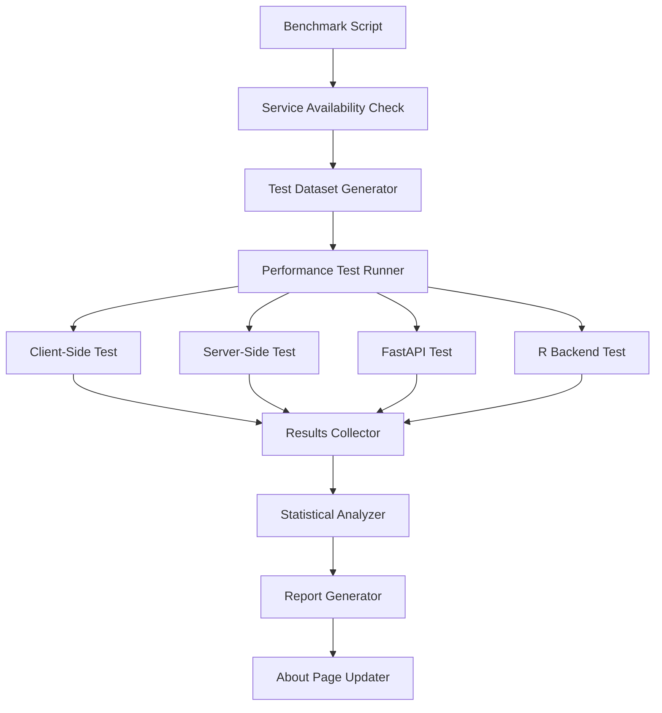
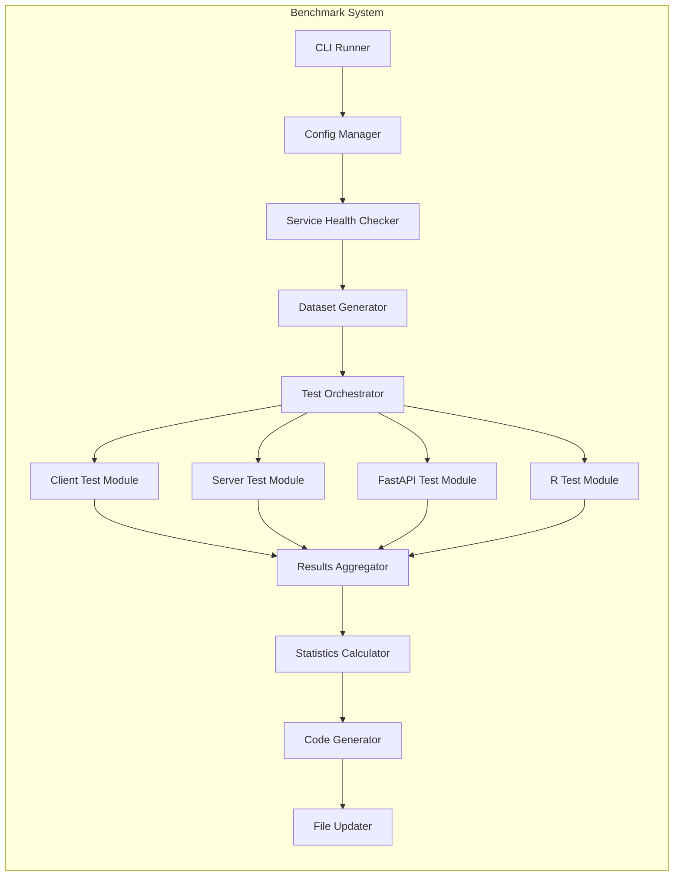

# Design Document

## Overview

Il sistema di benchmarking delle performance è progettato come uno script eseguibile manualmente che testa sistematicamente tutte le implementazioni disponibili (client-side, server-side, FastAPI, R) con dataset di diverse dimensioni, raccoglie metriche precise e genera i dati necessari per aggiornare la tabella delle performance nella pagina about.

## Architecture

### System Architecture Overview



### Component Architecture



## Components and Interfaces

### 1. Benchmark CLI Runner

**Interface:**
```typescript
interface BenchmarkConfig {
  testSizes: number[]           // [1000, 10000, 50000, 100000, 500000, 1000000]
  iterations: number            // Number of test iterations per size
  timeout: number              // Timeout per test in milliseconds
  services: ServiceConfig[]    // Configuration for each service
}

interface ServiceConfig {
  name: string                 // 'client-side' | 'server-side' | 'fastapi' | 'r-backend'
  enabled: boolean
  endpoint?: string           // For API-based services
  timeout?: number           // Service-specific timeout
}
```

**Implementation:**
```bash
# Usage examples
npm run benchmark              # Run all tests with default config
npm run benchmark -- --sizes=1000,10000,50000  # Custom dataset sizes
npm run benchmark -- --services=fastapi,r-backend  # Test specific services
npm run benchmark -- --iterations=5   # More iterations for accuracy
```

### 2. Service Health Checker

**Interface:**
```typescript
interface HealthCheckResult {
  service: string
  available: boolean
  responseTime?: number
  error?: string
  version?: string
}

class ServiceHealthChecker {
  async checkAllServices(): Promise<HealthCheckResult[]>
  async checkService(config: ServiceConfig): Promise<HealthCheckResult>
}
```

**Implementation Strategy:**
- FastAPI: `GET /health` endpoint check
- R Backend: `GET /api/health` endpoint check  
- Server-side: Internal Next.js API route test
- Client-side: Browser automation with Puppeteer

### 3. Test Dataset Generator

**Interface:**
```typescript
interface TestDataset {
  size: number
  data: VolcanoDataPoint[]
  metadata: {
    generated_at: string
    significant_points: number
    categories: Record<string, number>
  }
}

class DatasetGenerator {
  generateDataset(size: number): TestDataset
  generateConsistentDatasets(sizes: number[]): TestDataset[]
}
```

**Implementation:**
- Utilizza lo stesso algoritmo di generazione per tutti i test
- Seed fisso per risultati riproducibili
- Distribuzione realistica di punti significativi/non significativi
- Categorie metaboliche bilanciate

### 4. Performance Test Modules

#### Client-Side Test Module
```typescript
interface ClientSideTestResult {
  service: 'client-side'
  dataset_size: number
  parse_time: number
  processing_time: number
  render_time: number
  total_time: number
  memory_usage?: number
  success: boolean
  error?: string
}

class ClientSideTestModule {
  async runTest(dataset: TestDataset): Promise<ClientSideTestResult>
}
```

**Implementation:**
- Utilizza Puppeteer per automatizzare il browser
- Misura tempi di parsing CSV, processing e rendering
- Monitora utilizzo memoria tramite Performance API
- Gestisce timeout e errori gracefully

#### Server-Side Test Module
```typescript
interface ServerSideTestResult {
  service: 'server-side'
  dataset_size: number
  api_response_time: number
  processing_time: number
  total_time: number
  success: boolean
  error?: string
}

class ServerSideTestModule {
  async runTest(dataset: TestDataset): Promise<ServerSideTestResult>
}
```

**Implementation:**
- Chiama direttamente le API routes di Next.js
- Misura tempo di risposta end-to-end
- Testa con dati reali via multipart/form-data
- Verifica consistenza dell'output

#### FastAPI Test Module
```typescript
interface FastAPITestResult {
  service: 'fastapi'
  dataset_size: number
  api_response_time: number
  processing_time: number
  cache_hit: boolean
  total_time: number
  success: boolean
  error?: string
}

class FastAPITestModule {
  async runTest(dataset: TestDataset): Promise<FastAPITestResult>
}
```

**Implementation:**
- Testa sia first-time che cached requests
- Misura tempi di processing Python/Polars
- Verifica downsampling intelligente
- Monitora utilizzo memoria del processo

#### R Backend Test Module
```typescript
interface RBackendTestResult {
  service: 'r-backend'
  dataset_size: number
  api_response_time: number
  processing_time: number
  json_conversion_time: number
  total_time: number
  success: boolean
  error?: string
}

class RBackendTestModule {
  async runTest(dataset: TestDataset): Promise<RBackendTestResult>
}
```

**Implementation:**
- Testa l'API Plumber R
- Misura separatamente processing e JSON conversion
- Verifica ottimizzazioni data.table
- Gestisce memory limits e timeout

### 5. Results Aggregator and Statistics

**Interface:**
```typescript
interface BenchmarkResults {
  timestamp: string
  config: BenchmarkConfig
  results: TestResult[]
  statistics: PerformanceStatistics
  recommendations: ServiceRecommendation[]
}

interface PerformanceStatistics {
  [service: string]: {
    [dataset_size: number]: {
      mean: number
      std_dev: number
      min: number
      max: number
      success_rate: number
      sample_size: number
    }
  }
}

interface ServiceRecommendation {
  dataset_size: number
  recommended_service: string
  reason: string
  performance_comparison: Record<string, number>
}
```

### 6. Code Generator and File Updater

**Interface:**
```typescript
interface AboutPageUpdate {
  performance_matrix: PerformanceMatrixData
  last_updated: string
  benchmark_metadata: BenchmarkMetadata
}

class AboutPageUpdater {
  generatePerformanceMatrix(results: BenchmarkResults): PerformanceMatrixData
  updateAboutPage(update: AboutPageUpdate): void
  backupCurrentVersion(): string
}
```

## Data Models

### Performance Matrix Data Structure

```typescript
interface PerformanceMatrixData {
  datasets: {
    size: number
    label: string
  }[]
  services: {
    name: string
    label: string
    color_class: string
  }[]
  results: {
    dataset_size: number
    service: string
    time: string | null      // "~200ms" or null if failed
    status: 'success' | 'timeout' | 'error' | 'not_tested'
    recommendation_badge?: string
  }[]
  metadata: {
    last_updated: string
    benchmark_version: string
    test_iterations: number
  }
}
```

### Test Configuration Schema

```typescript
interface BenchmarkConfiguration {
  version: string
  test_sizes: number[]
  iterations_per_test: number
  timeout_ms: number
  services: {
    client_side: {
      enabled: boolean
      browser: 'chromium' | 'firefox'
      headless: boolean
    }
    server_side: {
      enabled: boolean
      endpoint: string
    }
    fastapi: {
      enabled: boolean
      endpoint: string
      test_cache: boolean
    }
    r_backend: {
      enabled: boolean
      endpoint: string
    }
  }
  output: {
    format: 'json' | 'csv' | 'both'
    update_about_page: boolean
    backup_original: boolean
  }
}
```

## Error Handling

### Service Unavailability
```typescript
// Graceful handling when services are down
if (!healthCheck.available) {
  results.push({
    service: config.name,
    dataset_size: size,
    success: false,
    error: `Service unavailable: ${healthCheck.error}`,
    total_time: 0
  })
  continue
}
```

### Timeout Management
```typescript
// Per-service timeout with graceful degradation
const timeoutPromise = new Promise((_, reject) => 
  setTimeout(() => reject(new Error('Test timeout')), config.timeout)
)

try {
  const result = await Promise.race([testPromise, timeoutPromise])
  return result
} catch (error) {
  return {
    success: false,
    error: error.message,
    total_time: config.timeout
  }
}
```

### Memory Management
```typescript
// Monitor memory usage during tests
const memoryBefore = process.memoryUsage()
const result = await runTest(dataset)
const memoryAfter = process.memoryUsage()

result.memory_delta = {
  heap_used: memoryAfter.heapUsed - memoryBefore.heapUsed,
  heap_total: memoryAfter.heapTotal - memoryBefore.heapTotal
}
```

## Testing Strategy

### Unit Testing
- Test individual modules with mock data
- Validate statistical calculations
- Test error handling scenarios
- Verify configuration parsing

### Integration Testing
- Test with real services running
- Validate end-to-end workflow
- Test file update operations
- Verify backup and restore functionality

### Performance Validation
- Compare results with manual measurements
- Validate statistical accuracy
- Test with various dataset sizes
- Verify timeout handling

## Implementation Phases

### Phase 1: Core Infrastructure
- CLI runner and configuration system
- Service health checking
- Basic test dataset generation
- Results collection framework

### Phase 2: Test Modules Implementation
- Client-side testing with Puppeteer
- Server-side API testing
- FastAPI integration testing
- R backend testing

### Phase 3: Statistics and Analysis
- Statistical analysis of results
- Performance comparison algorithms
- Recommendation generation
- Report formatting

### Phase 4: About Page Integration
- Code generation for performance matrix
- File update mechanisms
- Backup and restore functionality
- Final integration testing

## Configuration and Deployment

### Default Configuration
```json
{
  "version": "1.0.0",
  "test_sizes": [1000, 10000, 50000, 100000, 500000, 1000000],
  "iterations_per_test": 3,
  "timeout_ms": 30000,
  "services": {
    "client_side": { "enabled": true, "browser": "chromium", "headless": true },
    "server_side": { "enabled": true, "endpoint": "http://localhost:3000" },
    "fastapi": { "enabled": true, "endpoint": "http://localhost:8000", "test_cache": true },
    "r_backend": { "enabled": true, "endpoint": "http://localhost:8001" }
  },
  "output": {
    "format": "json",
    "update_about_page": true,
    "backup_original": true
  }
}
```

### Environment Setup
```bash
# Required services for full testing
docker-compose up fastapi r-backend  # Start backend services
npm run dev                          # Start Next.js development server
npm run benchmark                    # Run performance tests
```

### Output Files
- `benchmark-results.json`: Raw test results
- `performance-matrix.json`: Processed data for about page
- `about-page-backup.tsx`: Backup of original about page
- `benchmark-report.md`: Human-readable report

## Risk Mitigation

### Service Dependencies
- **Risk:** External services may be unavailable during testing
- **Mitigation:** Health checks before testing, graceful failure handling, partial results reporting

### Browser Automation Reliability
- **Risk:** Puppeteer tests may be flaky or inconsistent
- **Mitigation:** Multiple iterations, headless mode, timeout handling, retry logic

### File Update Safety
- **Risk:** Updating about page could break the application
- **Mitigation:** Automatic backup, validation of generated code, rollback capability

### Performance Measurement Accuracy
- **Risk:** System load may affect measurement accuracy
- **Mitigation:** Multiple iterations, statistical analysis, outlier detection, system resource monitoring