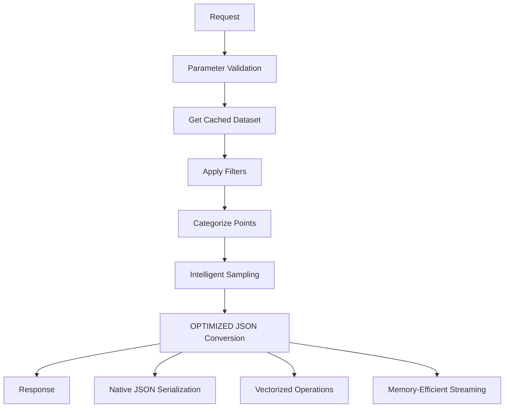

# Design Document

## Overview

Il design per l'ottimizzazione delle performance dell'API R si concentra sull'eliminazione del bottleneck principale identificato: la conversione inefficiente da data.table a formato JSON. L'analisi del codice ha rivelato che la funzione `convert_to_data_points()` utilizza un loop esplicito per convertire ogni riga in un oggetto lista, che è estremamente inefficiente per dataset grandi.

## Architecture

### Current Performance Bottleneck Analysis

**Problema Identificato:**
```r
# BOTTLENECK: Loop esplicito per ogni riga
for (i in seq_len(n_rows)) {
  result[[i]] <- list(
    gene = data_points$gene[i],
    logFC = data_points$logFC[i],
    # ... altri campi
  )
}
```

**Confronto con Python:**
```python
# Python usa operazioni vettorizzate native di Polars
data_dicts = df.to_dicts()  # Conversione nativa ottimizzata
for row in data_dicts:      # Iterazione su dati già convertiti
    data_points.append(VolcanoDataPoint(...))
```

### Proposed Architecture



## Components and Interfaces

### 1. Optimized JSON Conversion Module

**Interface:**
```r
convert_to_json_optimized <- function(dt, use_streaming = TRUE)
```

**Implementation Strategy:**
- Utilizza `jsonlite::toJSON()` direttamente su data.table
- Elimina la conversione intermedia a lista di liste
- Implementa streaming per dataset molto grandi

### 2. Memory-Efficient Data Processing

**Interface:**
```r
process_volcano_data_optimized <- function(dt, params, streaming_threshold = 100000)
```

**Features:**
- Processamento in chunks per dataset grandi
- Garbage collection automatico
- Monitoraggio memoria in tempo reale

### 3. Performance Monitoring System

**Interface:**
```r
monitor_performance_detailed <- function(func, context, ...)
```

**Capabilities:**
- Timing granulare per ogni fase
- Profiling memoria
- Logging strutturato per analisi

## Data Models

### Optimized Response Format

```r
# Invece di lista di liste, usa data.table direttamente
optimized_response <- list(
  data = jsonlite::toJSON(dt, dataframe = "rows", auto_unbox = TRUE),
  stats = stats,
  metadata = metadata
)
```

### Performance Metrics Model

```r
performance_metrics <- list(
  phase_timings = list(
    data_generation = 0.0,
    filtering = 0.0,
    categorization = 0.0,
    sampling = 0.0,
    json_conversion = 0.0,
    total = 0.0
  ),
  memory_usage = list(
    peak_mb = 0.0,
    current_mb = 0.0,
    gc_count = 0
  ),
  data_stats = list(
    input_rows = 0,
    output_rows = 0,
    compression_ratio = 0.0
  )
)
```

## Error Handling

### Memory Management

```r
# Automatic garbage collection when memory threshold exceeded
if (memory_usage > MEMORY_THRESHOLD) {
  gc(verbose = FALSE)
  log_message("Automatic GC triggered", "INFO", "MEMORY")
}
```

### Graceful Degradation

```r
# Fallback to chunked processing for very large datasets
if (nrow(dt) > STREAMING_THRESHOLD) {
  return(process_in_chunks(dt, chunk_size = 50000))
}
```

### Timeout Handling

```r
# Implement request timeout with partial results
tryCatch({
  result <- process_with_timeout(dt, timeout_seconds = 30)
}, timeout = function(e) {
  return(partial_result_with_warning())
})
```

## Testing Strategy

### Performance Benchmarking

1. **Micro-benchmarks:** Test singole funzioni ottimizzate
2. **Integration benchmarks:** Test end-to-end con dataset realistici  
3. **Stress testing:** Test con dataset molto grandi (1M+ punti)
4. **Memory profiling:** Monitoraggio uso memoria durante processing

### Regression Testing

1. **Output validation:** Garantire che l'output ottimizzato sia identico all'originale
2. **API compatibility:** Verificare che l'interfaccia rimanga invariata
3. **Error handling:** Test scenari di errore e edge cases

### Performance Targets

| Dataset Size | Current Time (R) | Target Time | Python Baseline |
|-------------|------------------|-------------|-----------------|
| 10K points  | ~500ms          | <200ms      | ~100ms         |
| 100K points| ~5s             | <2s         | ~800ms         |
| 500K points| ~25s            | <8s         | ~3s            |
| 1M points   | >60s            | <15s        | ~6s            |

## Implementation Phases

### Phase 1: JSON Conversion Optimization
- Sostituire loop esplicito con `jsonlite::toJSON()`
- Implementare conversione diretta da data.table
- Aggiungere benchmarking granulare

### Phase 2: Memory Management
- Implementare processamento in chunks
- Aggiungere garbage collection automatico
- Ottimizzare uso memoria durante filtering

### Phase 3: Advanced Optimizations
- Implementare streaming per dataset molto grandi
- Aggiungere compressione response
- Ottimizzare caching strategy

### Phase 4: Monitoring and Diagnostics
- Implementare metriche performance dettagliate
- Aggiungere endpoint diagnostici
- Creare dashboard monitoring

## Risk Mitigation

### Compatibility Risk
- **Risk:** Cambiamenti potrebbero rompere compatibilità
- **Mitigation:** Mantenere interfaccia API identica, test regressione estensivi

### Memory Risk  
- **Risk:** Ottimizzazioni potrebbero aumentare uso memoria
- **Mitigation:** Monitoring continuo, fallback a processamento chunked

### Performance Risk
- **Risk:** Ottimizzazioni potrebbero non raggiungere target
- **Mitigation:** Benchmarking incrementale, rollback plan preparato